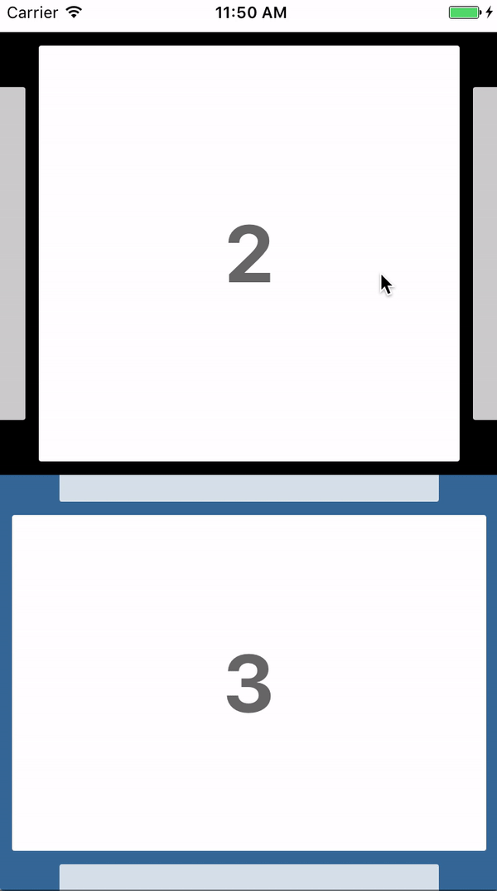

# react-native-carousel-pager
[](https://npmjs.org/package/react-native-carousel-pager)
<p>
    
</p>

## Installation
```bash
npm install react-native-carousel-pager --save
```
or
```bash
yarn add react-native-carousel-pager
```

## Usage
```js
import {View} from 'react-native';
import React, {Component} from 'react';
import CarouselPager from 'react-native-carousel-pager';

export default class Pager extends Component {
  render() {
    return (
      <View style={{flex: 1}}>
        <CarouselPager initialPage={2} pageStyle={{backgroundColor: '#fff'}}>
          <View key={'page0'}></View>
          <View key={'page1'}></View>
          <View key={'page2'}></View>
          <View key={'page3'}></View>
        </CarouselPager>
      </View>
    );
  }
}
```

## Properties

Name | propType | default value | description
--- | --- | --- | ---
initialPage | number | 0 | Initial page to display on render
vertical | boolean | false | Set to `true` if carousel should be vertical
blurredZoom | number | 0.8 | Zoom (number between 0 and 1) to apply to blurred pages
blurredOpacity | number | 0.8 | Opacity (number between 0 and 1) to apply to blurred pages
containerPadding | number | 30 | Container padding (used to display part of preceding and following pages)
pageSpacing | number | 10 | Space between pages
pageStyle | object | null | Style to apply to each page
